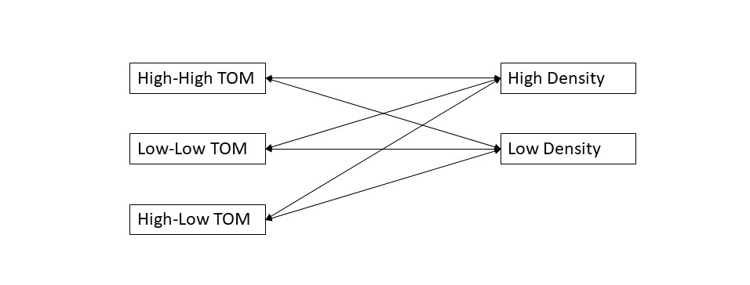

```{r setup, include=FALSE}
library(emmeans)
library(ggplot2)
library(tidyverse)
knitr::opts_chunk$set(echo=TRUE)
```

## Principles of Good Design

1. Keep it simple.
1. Ask direct 'falsifiable' question.
1. Make strong a priori prediction.
1. Control for as much as you can (temperature, flow rates, tank effects, time of year, etc.).
1. Randomize over what you can't control.
1. Have an analysis plan.
1. Simulate what you think your experimental outcomes will be.
1. Ensure enough replication to answer your hypothesis with confidence.
1. Plan for when things might go wrong.

## Experimental Design

- We will split this lecture into Experimental Design and Study Design.
- Experimental Design will be where you physically influence the experimental unit and record the effect.
- Can be done in the field, or in the lab.
- Study Design will be focused on observing the existing world.

## Response Variable

- Dependent Variable

- Measuring this sheds light on your hypothesis.

- Example: Length, width, or mass of oysters grown in different tanks under different scenarios.

## Factors

- Independent Variables

- Example: Impact of temperature on growth rate of oysters.

- Treatment/Control: Temperatures chosen based on what we expect in the field (control) and what we may influence to improve growth rates (warmer or cooler).

- Nuisance Variable: e.g. initial oyster size. We may control for this by choosing oysters that are all nearly the same size. Or by randomly choosing oysters and measuring their sizes to see if that influences the results.

- May choose to choose three different sizes of oysters to control for any size/age influence on our results.

## Randomization:

- Ensures our estimates are unbiased!
- Controls for lurking variables you forgot or didn't know about.
- Examples of non-random sampling:
  - I know that tide pool has lots of species in it so I will get my samples from it.
  - I've seen lots of fish in this area, so let's sample there.
  - I don't want to walk too far, so let's just sample near here.
  - Let's not change the tank set ups so we will just use tank 1 for all of treatment 1, and tank 2 for all of treatment 2. (Tanks are different sizes)

## Design Types:

- Completely Randomized Design (CRD): Every combination of trials is taken completely at random. 

- Factorial Design - To study effect of two or more factors.
  - Multiple levels of each factor.
  - Run trials for all combinations of all factors.
  - Interaction can mask main effects.
  - E.g. Sex (M,F) and Exposure (Protected/Exposed) - $2\times2$ factorial.

---

- Blocking
  - Control for a nuisance factor.
  - Repeat each factor of interest within a level of the block.
  - E.g. Recruitment of mussels on two types of surfaces. 10 Different bays selected. Control for exposure types by finding an exposed/unexposed section of each bay to place the trials in (The bay is the block).
  - Often treated as a repeated measure in the analysis.


## Sea Cucumber Experiment

- Hypothesis: Does nutrient enrichment in a lab, typical of aquaculture sites, impact how sea cucumbers move/behave?

- Hypothesis 1: Sea cucumbers will spend more time in nutrient enriched areas.

- Hypothesis 2: Sea cucumbers will move more when food is scarce.

- Question: Are these behaviours density dependent?

## A Priori Prediction

- Theory: Less food availability = More foraging
- Movement Low TOM > Movement High TOM
- Theory: Density increases competition
- Movement High Density > Movement Low Density
- HD_HH > LD_HH > HD_LL > LD_LL

## Set Up:

1. 2 levels of Animal Density: 9 individuals (High Density) vs 1 individual (Low Density)
1. Three levels of Total Organic Material: H-H, L-L, H-L, H-M
1. Replicate each density/TOM combination 7 times.
1. Each trial takes 24 hours.
1. I have access to 2, 3 m wide tanks.
1. Total number of experiments, $N = 2\times4\times7 = 56$ 
1. Minimum time of experiments (with no failures), $T = 56/2 = 28$ days.
1. Record the position of each sea cucumber's mouth every 5 minutes until it settles on the side of the tank.


## What trials do we need to run?

- 3 Levels of TOM Treatment (H-H, H-L, L-L) ***(ignore H-M)***
- 2 Levels of Density (H, L)
- To answer our quesion we want all combinations of treatments.
- Therefore, we need a $3\times2$ Factorial design.

```{r, echo=FALSE}

```


## Tank Set Up

```{r, echo=FALSE}

```

## Tank Set Up

```{r, echo=FALSE}

```


## Discuss Experiment

1. What are things we may want to control for?
1. What are things we may want to randomize over?
1. What is the response variable?
1. What is the treatment?
1. Is there a control?
1. Where do we get animals?

## R Example:

```{r}
## Create the Design
factorial.design <- data.frame(expand.grid(Dens = c("H", "L"), 
                                            Trt = c("HH", "LL", "HL"), 
                                           replicate = 1:7))
n.trials <- nrow(factorial.design)

## Randomize it
set.seed(555)   # Why set seed?????
factorial.design.rand <- factorial.design[sample(n.trials, n.trials, 
                                                 replace = FALSE),]
```

---

```{r}
## Let's see what your schedule is:
head(factorial.design.rand)
```

## Response Variable

- Record the position of each sea cucumber's mouth every 5 minutes until it settles on the side of the tank.
- For experiment $k = 1,\ldots,7$ with TOM $i = HH,LL,HL$ and Density $j = H,L$,
  - Distance traveled ($d_{ijk}$)
  - Time spent foraging ($t_{ijk}$)
  - Mean Resultant Length ($r_{ijk}$), as a measure for randomness of movement

- Analysis to match this design for $d_{ijk}$,
$$
\begin{align}
  d_{ijk} & =  \mu + \tau_i + \beta_j + (\tau\beta)_{ij} + \epsilon_{ijk} \\
  \epsilon_{ijk} & \sim  \mathcal{N}(0, \sigma^2).
\end{align}
$$

## Explicit Model Based Hypothesis

- Overall Mean $\mu$.
- Treatment effect on $\mu$ of TOM level $i$, $\tau_i$.
- Treatment effect on $\mu$ of Density level $j$, $\beta_j$.
- Interaction effect of TOM level $i$ and Density level $j$, $(\tau\beta)_{ij}$.
- Experiment $k$ random noise $\epsilon_{ijk}$.
- Here are the hypotheses that an ANOVA will test.

---

- Main TOM Effect
$$
  H_0: \, \tau_{HH} = \tau_{LL} = \tau_{HL}\\
  H_a: \, \text{at least one } \tau_i \neq 0
$$

- Main Density Effect

$$
  H_0: \, \beta_{H} = \beta_{L}\\
  H_a: \, \beta_H \neq \beta_L
$$

- Interaction Effect

$$
  H_0: \, (\tau\beta)_{HH,L} = ,\ldots, = (\tau\beta)_{LL,H} \\
  H_a: \, \text{at least one } (\tau\beta)_{ij} \neq 0
$$

## Visualize it

```{r, echo = FALSE}
  load("./data/CukeDatExample.Rda")
  cuke.length.example$block <- factor((cuke.length.example$Trial - 1) %/% 8 + 1)
  cuke.length.example$DensHL <- factor(cuke.length.example$Dens, labels = c("L", "H"))
  ggplot(data = cuke.length.example, aes(x = Trt, y = mean_length, colour = Dens)) + 
      geom_boxplot() + theme_classic()
```


## Replication

- The number of experimental units you have repeated for each treatment combination (i.e. number of independent samples per treatment combination).

- Often the most expensive part of the experiment. This is where we do power analysis.

- How many replications of the sea cucumber trial were there?

## Repeated Measurements

- Replication within a single experimental unit.

- See Hurlbert (1984) for a discussion about repeated measurements. They are not as scary as traditional books might say and super important to understanding noisy processes. One repeated measurement, does not equal one new sample. But it also doesn't mean zero additional information!

- Sea Cucumbers: How many repeated measurements are there?

## A Long Story Short

- Repeated Measures are Useful.
- We need more advanced analysis methods but get more information!
- 1 Repeated Measure $\neq$ 1 Replicate.
- 1 Repeated Measure $\neq$ 0 Replicate.

## Blocking the Sea Cucumbers

```{r}
set.seed(1224)
factorial.design.block <- factorial.design %>%
    group_by(replicate) %>%
    mutate(sampleOrder = sample(n())) %>%
    arrange(sampleOrder, .by_group = TRUE) %>%
    ungroup()
head(factorial.design.block)
```

## Visualizing a Block Effect

```{r, echo = FALSE}
  load("./data/CukeDatExample.Rda")
  cuke.length.example$block <- factor((cuke.length.example$Trial - 1) %/% 8 + 1)
  cuke.length.example$DensHL <- factor(cuke.length.example$Dens, labels = c("L", "H"))
  ggplot(data = cuke.length.example, aes(x = block, y = mean_length)) + 
      geom_boxplot() + theme_classic() 
```

## Example by Garth


## Class Study Design

- Research Question: Garth can you come up with one here?
