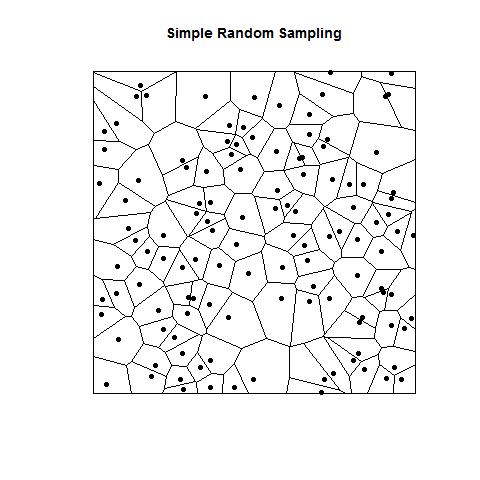
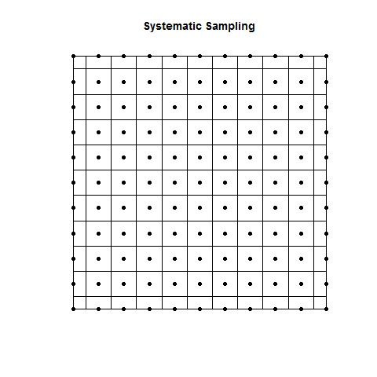
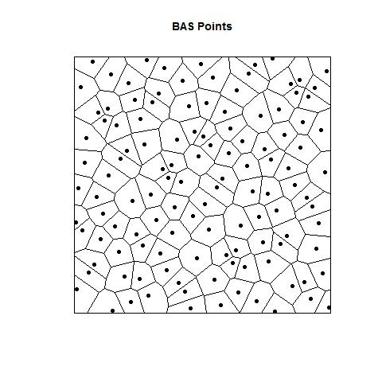
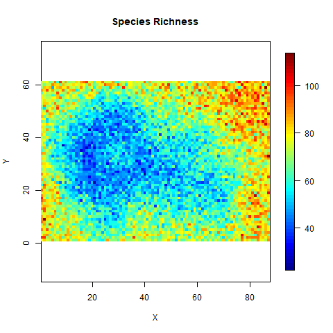
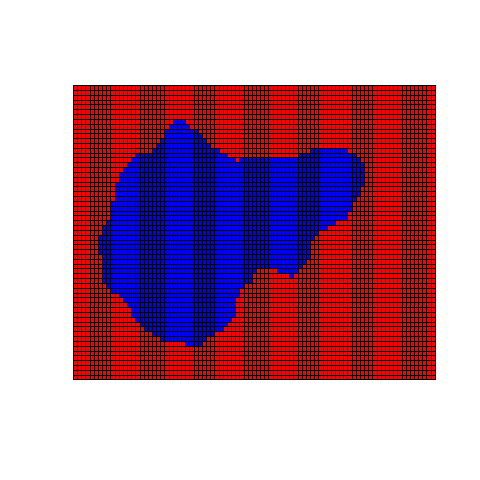
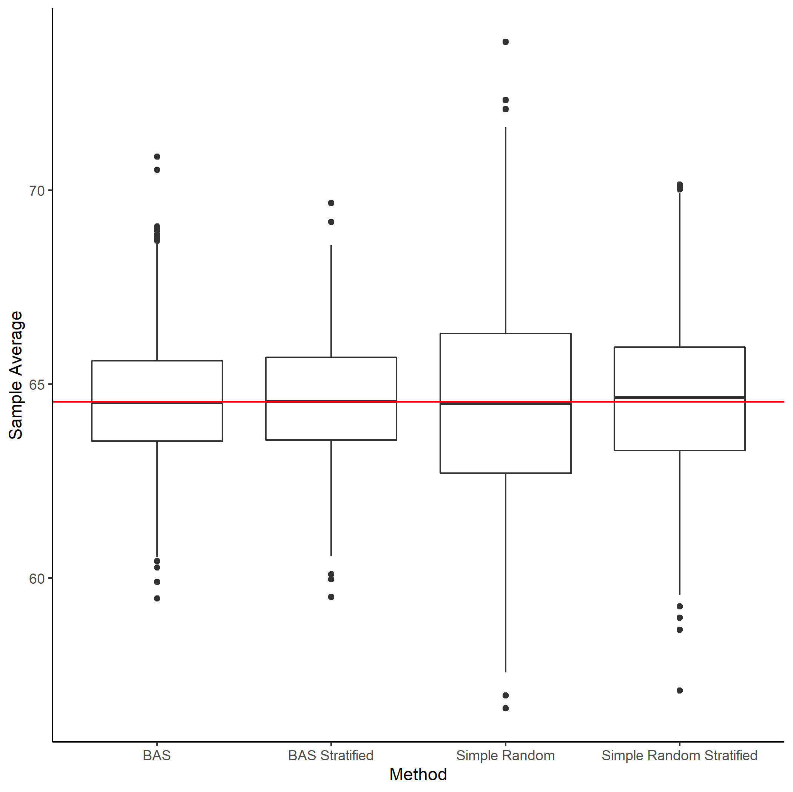

```{r setup, include=FALSE}
library(emmeans)
library(ggplot2)
library(tidyverse)
library(sf)
library(sp)
library(rgdal)
library(spsurvey)
library(fields)
library(raster)
knitr::opts_chunk$set(echo=TRUE)
```

## Field Study

1. What is your area/population of interest?
1. Where can you safely access within that?
1. How will you select your study sites?
1. What kind of field methods will you use?
1. How many places do you need to go?

## Target Area

- Spatial Extent for which you wish to make inference.
- Example: Suitable habitat for black leather Chiton in Barkley Sound. 
  - Represent the spatial extent with a map.
  
## Sample Frame

- A list/or map for which you will select your samples from.
- This may be a subset of the target area due to constraints such as,
  - Access (safety, cost)
- The sample frame represents what our scale of inference will be.
- If sites are missing at random, then it will represents the target area.
- When we can't access certain types of sites (e.g. exposed shoreline due to safety), then we can't make inference on those features.

## Monitoring a Single Beach

- Question, how does tide height impact tide pool invertebrate diversity (e.g. richness) on Brady's Beach? 
- Target Area: All tide pools on Brady's Beach.
- Sample Frame: A list of all safely accessible tide pools, including their coordinates, and their area.

## Monitoring Barkley Sound

- Question, how does tide height impact tide pool invertebrate diversity (e.g. richness) in Barkley Sound? 
- Target Area: All tide pools in Barkley Sound.
- Sample Frame: A list of all accessible tide pools and their coordinates, and area (unfeasible).
- In this case, we may do something called two-stage sampling (or cluster) sampling if we don't have a way of defining all tide pools in Barkley Sound.

## Observational Experiment (Before-After)

- Example: We want to know if marine protected areas are increasing rockfish abundance.
- Perfect world: Before-After Monitoring.
- Sample for 2 years prior to creating the MPA, 5 years after (as per MOE guidelines...)

## Observational Experiment (Control-Impact)

- Example: We want to know if marine protected areas are increasing rockfish abundance.
- Imperfect world: We have already protected this area.
- Find a 'paired' site and monitor rockfish abundance there and compare the two.
- Does this work? How do we choose a control?
- Often a very close site that has similar features.
- Or sampling away from the MPA to see if there is a decline in abundance as you move away.

## Observational Experiment (BACI)

- Before-After Control-Impact

- Measure before and after a treatment is introduced. Keep some that never get the treatment.

- Fundamental in environmental consulting for industry. Monitor before the project starts and after it is completed. Choose a paired site that doesn't have project effects to also monitor.

- Example: Before protecting the area, define a control site and monitor future MPA and control site for 2 years. Then monitor for 5 years after protected.

- With a BACI we can separate general trends with the actual treatment effect!

## BACI

```{r, echo=FALSE}
baci <- data.frame(expand.grid(BA = .0:1, CI = 0:1))
baci <- baci %>% mutate(BA = factor(BA, labels = c("Before", "After")), CI = factor(CI, labels = c("Control", "Impact")))
baci.pos <- baci %>% mutate(response = c(1, 1.25, 1.3, 1.42))
ggplot(data = baci.pos, aes(x = BA, y = response, colour = CI)) + 
  geom_point(aes(group = CI)) + 
  geom_line(aes(x = as.numeric(BA))) +
  theme_classic()
```

## Site Selection: Define Feature Type

- Rivers and coastline might be linear features (lines).
  - We will treat points and a list as the same for the purpose of randomization.
- Lakes, beaches, tide pools etc might be defined by their centroids (points)
- Coast, terrestrial sampling, within a lake will be defined as a polygon.

## Randomization Method

- Simple Random Sample: Choose completely at random sites to sample.
- Systematic Sampling: Choose using a transect, or grid sites evenly spaced.
- Spatially Balanced Sampling: Combination of SRS and SS to have nice even spread but random.
- If you are doing a spatial survey, use spatial balance. It is always as good or beter than the other methods.
- By better I mean smaller variance.

## Inclusion Probability

- For a finite resource, the probability the $i$th unit is selected in any sample.
  - If we have $N = 20$ beachs we can access.
  - Wish to select a sample of size $n = 5$.
  - Under equal probability sampling,
  $$
    \pi_i = \frac{n}{N}
  $$
- For continuous resources (lines, polygons), it's called an inclusion density.

## Simple Random Example



## Systematic Sampling




## Spatially Balanced Sampling



## Example Spatial Surface

- Want to estimate mean richness in this study region




## Comparing Methods


## Stratified Sampling

- Blocking but in the field.
- We assume homogeneity within a stratum level and heterogeneity between.
- Set a fixed number of replicates within each stratum and then randomly select sites.
- Example: Wizard Islet: Sample transect along each tide height.
- Example: Average human height, split sample into males and females.
- Example: Protected vs exposed tide pools

## Example of Stratified Sample



## Example of Stratified Sample



## Simple Random Sampling

- Always works.
- Easy to do.
- Mean and Variance Estimators are what you expect.
- Sample Mean: $\bar{x} = \sum_{i=1}^n\frac{x_i}{n}$.
- Sample Variance: $var(x) = \sum_{i=1}^n(x_i-\bar{x})^2/n-1$.
- Disadvantage: Clumpy and not as efficient as other methods.

## Systematic Sampling

- Easy to Implement in the field. 
- Not always unbiased.
- Sample Mean is correct.
- Sample Variance is positively biased.
- Will be more efficient that simple random sampling most of the time.

## Spatially Balanced Sampling

- Some more complicated theory to understand.
- Very flexible.
- Mean is straightforward.
- Variance needs to be approximated.
- See spsurvey, SDraw, MBHDesign for R packages.

## Example 1: Area Sampling

- 	Rockfish Conservation Areas (RCAs) Pachena Point
```{r}
research_area <- readOGR("./data/conservationData/bcmca_hu_commercialfish_rcas_data.shp")
pachena <- st_as_sf(research_area, wtk = geometry) %>% 
    filter(NAME %in% "Pachena Point")
```  

---

```{r, echo = FALSE}
plot(st_geometry(pachena))
```

## Example 1: Simple Random Sample

```{r}
smp.srs <- pachena %>% st_sample(30)
plot(st_geometry(pachena))
plot(smp.srs, add = TRUE, pch = 16)
```

## Example 1: Systematic Sample

```{r}
smp.syst <- pachena %>% st_sample(30, type = "regular")
plot(st_geometry(pachena))
plot(smp.syst, add = TRUE, pch = 16)
```

## Example 1: Spatially Balanced

```{r}
smp.grts <- grts(pachena, 30)
plot(st_geometry(pachena))
plot(st_geometry(smp.grts$sites_base), add = TRUE, pch = 16)
```

## Example 2: Point Based

```{r}
research_area <- st_as_sf(research_area, wtk = geometry) 
plot(st_geometry(research_area))
```

---

```{r}
pts.all <- research_area %>% group_by(NAME) %>% st_centroid() %>% ungroup()
plot(st_geometry(pts.all))
```

## Example 2: Simple Random Sample

```{r}
smp2.srs <- pts.all %>% st_sample(30)
plot(st_geometry(pts.all))
plot(smp2.srs, add = TRUE, col = 'red', pch = 16)
```

## Example 2: Systematic Sampling

```{r}
smp2.syst <- pts.all %>% st_sample(30, type = 'regular')
plot(st_geometry(pts.all))
plot(smp2.syst, add = TRUE, col = 'red', pch = 16)
```

## Example 2: Spatially Balanced Sampling

```{r}
smp2.grts <- grts(pts.all, 30)
plot(st_geometry(pts.all))
plot(st_geometry(smp2.grts$sites_base), add = TRUE, col = 'red', pch = 16)
```

## Example 3: Line Based

```{r}
data(Illinois_River)
plot(st_geometry(Illinois_River))
```


## Example 3: Simple Random Sample

```{r}
smp3.srs <- Illinois_River %>% st_sample(30)
plot(st_geometry(Illinois_River))
plot(smp3.srs, add = TRUE, pch = 16, col = 'red')
```

## Example 3: Systematic Sample

```{r}
smp3.syst <- Illinois_River %>% st_sample(30, type = "regular")
plot(st_geometry(Illinois_River))
plot(smp3.syst, add = TRUE, pch = 16, col = 'red')
```

## Example 3: Spatially Balanced Sampling

```{r}
smp3.grts <- grts(Illinois_River, 30)
plot(st_geometry(Illinois_River))
plot(st_geometry(smp3.grts$sites_base), add = TRUE, col = 'red', pch = 16)
```

## Example 4: Stratified Sampling

- Let's build a fake example.
- From before, species richness is negatively associated with altitude.


```{r, echo = FALSE}
data( volcano)
n.x <- nrow( volcano)
n.y <- ncol( volcano)
image.plot( x=1:n.x, y=1:n.y, z=volcano, main="Mountain Height (m)", asp=1)
```

---

```{r}
# Create some sort of density surface for species richness:
richness <- t(apply(volcano, 1, FUN = function(x){rpois(length(x), lambda = exp(9 - 1*log(x)))}))
image.plot( x=1:n.x, y=1:n.y, z=richness, main="Species Richness", asp=1, xlab = "X", ylab = "Y")
```

## Stratification

- More effort where there is more variability!
- Higher richness, higher variability.
- For n = 30 sites, how should we stratify?
- High, Medium, Low Altitude?
- Levels = 145+, 115-144, 114-

---

```{r}
  r <- raster(nrows=n.y, ncols=n.x, xmn = 0, xmx = n.x, ymn = 0, ymx = n.y, resolution = 1)
  values(r) <- volcano[1:(n.x*n.y)]
  sfHigh <- rasterToPolygons(r, fun=function(x){
      x>=145}, n=4, na.rm=TRUE, digits=12, dissolve=FALSE)
  sfMed <- rasterToPolygons(r, fun=function(x){
      x<145 & x>=115}, n=4, na.rm=TRUE, digits=12, dissolve=FALSE)
  sfLow <- rasterToPolygons(r, fun=function(x){
      x<115}, n=4, na.rm=TRUE, digits=12, dissolve=FALSE)
```

---

```{r}
plot(sfHigh, col = "blue", xlim = c(0, n.x), ylim = c(0,n.y))
plot(sfMed, col = "yellow", add = TRUE)
plot(sfLow, col = "red", add = TRUE)
```


## Choosing Inclusion Probabilities

- $N_H = 1579$, $N_M = 1802$,and $N_L = 1926$.
- We want to 'over' sample low comparatively.
- Let's try, $n_H = 5$, $n_M = 10$, and $n_L = 15$?
- Each stratum is what proportion of total?
- Inclusion probability within each stratum?

```{r}
  w.h <- length(sfHigh)/length(r); pi.h <- 5/length(sfHigh)
  w.m <- length(sfMed)/length(r); pi.m <- 10/length(sfHigh)
  w.l <- length(sfLow)/length(r); pi.l <- 15/length(sfHigh)
```

## Let's try it:

```{r}
means.st.srs <- NULL
values(r) <- richness[1:(n.x*n.y)]
for(i in 1:1000){
  smpH <- coordinates(sfHigh[sample(length(sfHigh), 5),])
  smpM <- coordinates(sfMed[sample(length(sfHigh), 10),])
  smpL <- coordinates(sfLow[sample(length(sfHigh), 15),])

	vals.h <- extract(r, smpH)
	vals.m <- extract(r, smpM)
	vals.l <- extract(r, smpL)

	mean.st <- w.h*mean(vals.h) + w.m*mean(vals.m) + w.l*mean(vals.l)
	means.st.srs <- c(means.st.srs, mean.st)
}
```

---

```{r}
means.srs <- NULL
for(i in 1:1000){
  smp <- coordinates(r)[sample(length(r), 30),]
	vals <- extract(r, smp)
	means.srs <- c(means.srs, mean(vals))
}
```

---

```{r}
  boxplot(means.st.srs, means.srs)
  abline(h= mean(richness), col = 'red')
```

## Two-Stage Sampling

- Select a primary sample unit
- Take mulitple samples within that unit.
- Example: Barkely Sound tide pools. Select 10 random sites in Barkley Sound. Within each site, sample 10 randomly selected tide pools.
- Example: Monitoring clam abundance in BC. Select 50 beaches that are adequate clam habitat. Within each beach, collect quadrat abundance data on a transect line.